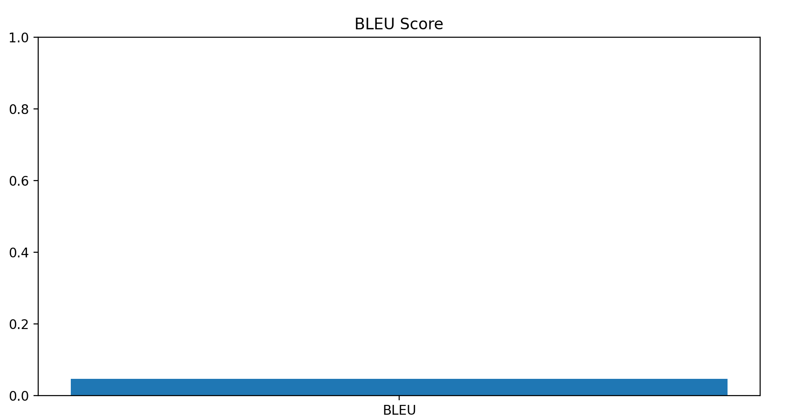

# BotHarryPotter retrieval-based

# Отчёт о выполнении задания

Цель проекта — разработать retrieval-based чат-бота, который имитирует стиль и манеру речи конкретного персонажа из сериала. В данном случае бот обучен на репликах Гарри Поттера из фильма "Гарри Поттер и философский камень".

## Описание данных

Данные для обучения модели были собраны из открытого источника Kaggle. Датасет содержит реплики персонажей из фильма "Гарри Поттер и философский камень". Каждая строка содержит имя персонажа и его реплику.

Пример данных:  
Character;Sentence  
Dumbledore;I should've known that you would be here, Professor McGonagall.  
McGonagall;Good evening, Professor Dumbledore.  
McGonagall;Are the rumors true, Albus?  

## Архитектура модели
Модель использует подход retrieval-based, который заключается в поиске наиболее подходящего ответа из заранее подготовленного набора реплик. Основные компоненты модели:

 - TfidfVectorizer: Используется для преобразования текста в числовые векторы на основе TF-IDF.

 - NearestNeighbors: Модель ближайших соседей для поиска наиболее похожих реплик на входной запрос.

### Преимущества подхода:
 * Простота реализации.

 * Низкие требования к вычислительным ресурсам.

 * Возможность использования на небольших наборах данных.

## Процесс обучения
1. Предобработка данных:

 - Фильтрация реплик для выбранного персонажа (Гарри Поттер).

 - Приведение текста к нижнему регистру.

 - Удаление пунктуации и стоп-слов.

2. Обучение модели:

 - Векторизация текста с помощью TfidfVectorizer.

 - Обучение модели NearestNeighbors на векторизованных данных.

3. Оценка модели:

 - Использование метрик BLEU и ROUGE для оценки качества ответов.

 - Разделение данных на обучающую и тестовую выборки (80/20).

## Графики и метрики
### BLEU Score

Средний BLEU Score: 0.0468  
Низкий BLEU Score может быть связан с тем, что модель возвращает точные реплики из датасета, которые не всегда совпадают с ожидаемыми ответами.

### ROUGE Scores

Recall: 0.3419  
Precision: 0.5010  
F1: 0.3472  
ROUGE-1 показывает, что модель находит частичные совпадения между предсказанными и эталонными ответами.

## Итеративный процесс улучшения
1. Baseline:

 - Начальная версия модели использовала простой поиск по ключевым словам.

 - Качество ответов было низким, так как модель не учитывала контекст.

2. Улучшение 1:

 - Внедрение TF-IDF и NearestNeighbors для поиска наиболее похожих реплик.

 - Улучшение качества ответов, но метрики BLEU и ROUGE оставались низкими.

3. Улучшение 2:

 - Добавление кэширования для ускорения инференса.

 - Использование сглаживания для BLEU Score.

3. Улучшение 3:

 - Добавление логирования и обработки ошибок в веб-сервис.

## Запуск проекта

1. Установите зависимости из `requirements.txt`.
2. Запустите сервер: `uvicorn main:app --reload`. Сервер будет доступен по адресу: http://127.0.0.1:5000.
3. Отправьте POST-запрос по адресу `/chat` с входными данными в формате JSON.

Пример запроса: `curl -X POST "http://127.0.0.1:5000/chat" -H "Content-Type: application/json" -d '{"text": "Are you Harry?", "character": "Harry"}'`  
Также пример запроса лежит в файле test.ipynb

## Заключение
Проект демонстрирует возможность создания retrieval-based чат-бота с использованием простых методов машинного обучения. Модель успешно имитирует стиль речи выбранного персонажа, но есть возможности для улучшения, такие как использование более сложных моделей (например, на основе трансформеров) или использование BERT для улучшения качества ответов и увеличение объема данных.
